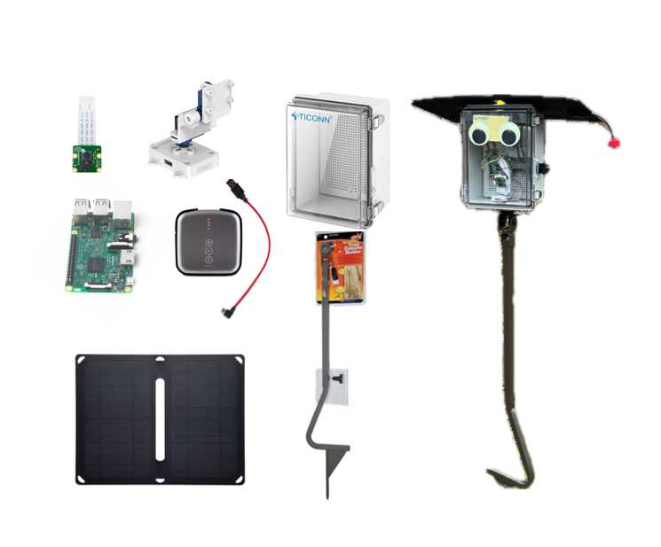

# FarmGazer code repo

created by @[Yuang Tong](https://github.com/Tongyuang) and @[Yusam Hsu](https://github.com/yusam123)

credit sponsor from Global Innovation Exchange and Microsoft.

## Introduction

This project realizes a farm monitoring system. The hardware consists of a raspberry Pi4, a camera and a pan-tilt motor. Hardware components are shown below.



## Run the code

#### Prerequisites
- Make sure you have ```adafruit_servokit``` module properly installed in your python environment.
- Make sure other packages in `requirements.txt` are also properly installed.

#### Run the code

1. Clone the repo
```git clone git@github.com:Tongyuang/guided_sr.git```

2. Properly connect the hardware components. 
- The [motor](https://www.amazon.com/Arducam-Upgraded-Camera-Platform-Raspberry/dp/B08PK9N9T4/?_encoding=UTF8&pd_rd_w=ycOtP&content-id=amzn1.sym.35cab78c-35e3-4fc1-aab0-27eaa6c86063%3Aamzn1.symc.e5c80209-769f-4ade-a325-2eaec14b8e0e&pf_rd_p=35cab78c-35e3-4fc1-aab0-27eaa6c86063&pf_rd_r=EEAS7HNKM877PTPEGXKA&pd_rd_wg=ZN3pD&pd_rd_r=c04b4bbd-6089-41fe-b1c0-f2de62ffcc62&ref_=pd_gw_ci_mcx_mr_hp_atf_m) is connected via SCL/SDA on raspberry pi, refer [this doc](https://www.arducam.com/downloads/arducam-pan-tilt-kit-manual.pdf) for connection details for pan-tilt motor.

3. run the script
```python3 main.py``` and follow the instruction in your terminal.
